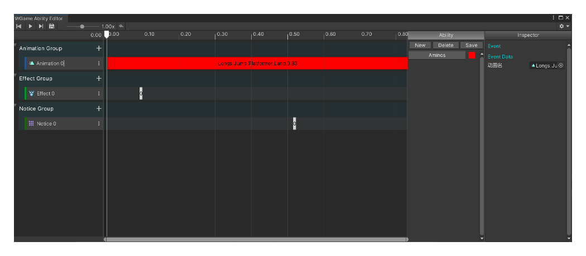

# 技能编辑器(AbilityEditor)

参考
[https://www.supercline.com/](https://www.supercline.com/)

## 介绍

时间轴用来展示编辑的数据，通过添加轨道和节点并编辑得到AbilityData数据。 
好处是可视化编辑和修改更方便，当加入预览功能和节点tooltip后会更加一目了然。 
由于技能种类多样，大部分数据可以采用下拉选择列表来使用，使编辑更加高效、易用、易读。 
当数据增多后可加入检索和撤销重做功能提高易用性。
