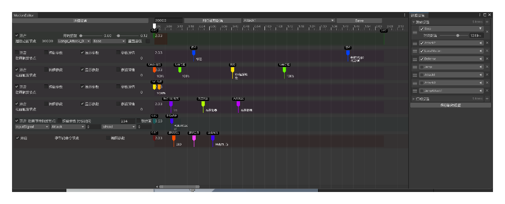

# 动作编辑器（MotionEditor）

## 介绍

时间轴形式，用来编辑角色动作在各个时间点上的各种行为和数据。 

特点是节点构成统一性高，使用的最多的Trigger类型是由TriggerType和TriggerData两个INT类型数据构成，通过编写的可视化脚本将INT数据用文本展示出来。 

好处是脚本规则更简单，拓展限制不算大且易于拓展，基本足够表达动作数据； 
缺点是可编辑数据较少且局限于两个整型，不能用于特别复杂的数据。

